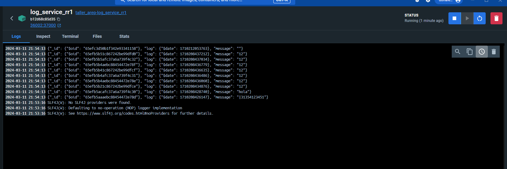

# TALLER DE TRABAJO INDIVIDUAL EN PATRONES ARQUITECTURALES


## Autor

Steven Alejandro Huertas Lemus

## Inicializar

1. Una vez descargado el repositorio puede iniciar a trabajar.

2. Puede realizar una inicializacion Local con el siguiente SCRIPT.

  

3. Sin embargo, lo recomendario es utilizar el archivo docker-compose (explicado en el video), una vez dento del repositorio utilice el comando:

```docker
docker-compose up
```
Vera que se iniciaran todas las intancias Docker.

 

Adicionalmente puede corroborar en Docker Desktop que este comando creara la etapa build de la imagen y tambien ejecutara en contenedores segun la configuracion.

Imagenes:

  

 Contenedores:
 
  

4. Finalmente podra entrar a la direccion con el puerto 36001 (fachada) y utilizar el programa.

 

Puede observar en los logs de los contenedores que se esta realizando el balanceo correctamente.

  

En el contenedor de fachada vemos todo exitoso.

  


## Docker HUB


Primero debemos realizar la creacion del TAG para subirlo a DockerHUB, esto con el fin de realizar pull de las imagenes en la instancia AWS

  

Realice un Script para subir los archivos...

  

## AWS

Iniciamos el laboratorio para poder acceder a nuestra instancia.

  

Configure todas las reglas necesarias para el funcionamiento, las deje abiertas por si se desean hacer consulta pero en principio solo se necesitaria el puerto de la fachada (36001) porque es el unico que veremos desde otro equipo.

  

Una vez realizado el pull de las imagenes (prueba en video) procedemos a contruir un nuevo archivo docker-compose con el fin de hacer el despliegue en funcion a las imagenes de DockerHUB.

  

Ejecutamos el docker-compose.

  

comprobamos los procesos en ls instancia AWS.

  

En esta imagen visualizamos como se realiza el balanceamiento en cada uno de los log service.

  

## Video

Adjunto el link al video.

https://youtu.be/H2semZr6j0Q?si=9aKEfRibV-yCbtnd
